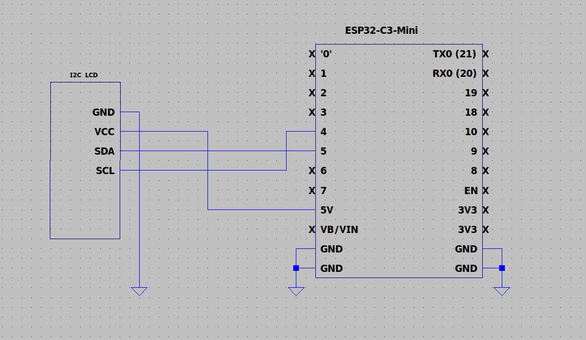
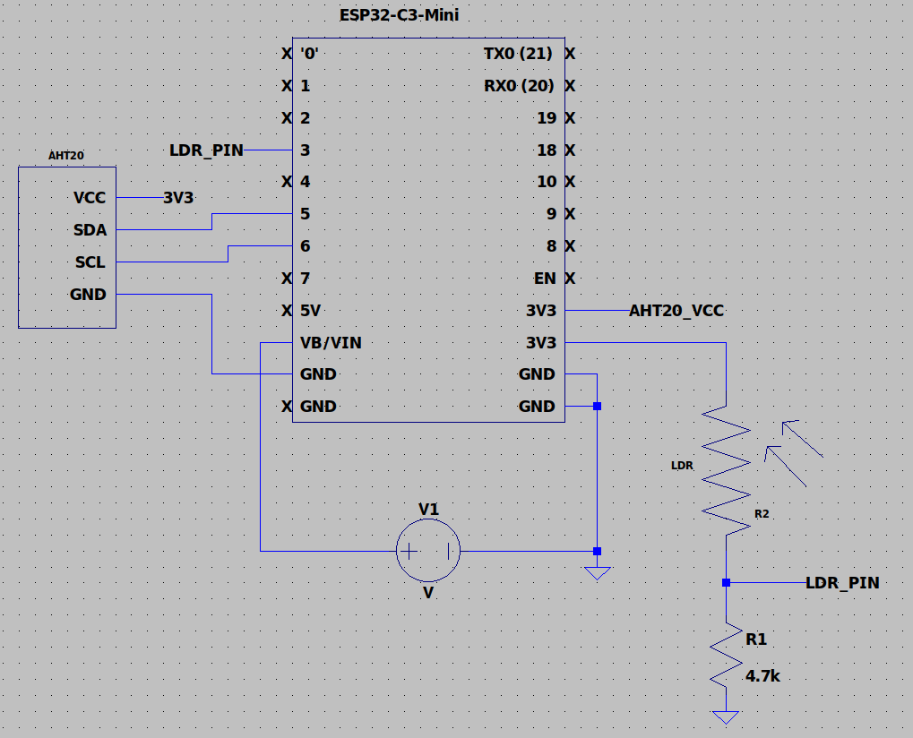

# ESP32-Weather-Station

#### This project was inspired from the IEEE Student Branch at UCI. This project consists of an ESP32, an LCD display, LDR, 4.7 kohm resistor and an AHT20 sensor. This is a simple weather station that consists of two esp32's. One will be transmitting data through ESP32 wiFi + ESP32-NOW consisting of humidity, temperature, and time of day. The second esp32 will receive that information through ESP WiFi + ESP-NOW and display it on the LCD. The transmitter will update information once every 10 seconds, and the receiver will update the LCD every 5 seconds. I have also created my own schematics in LTspice based off of the original schematic. Note that the AHT20, LiquidCrystal_I2C libraries are required. The WiFi library is custom, so you may have to download one, create your own, or use other WiFi libraries. There are 3 sketches, one for the recevier board, one for the transmitter board, and one for getting the MAC address of the receiver board. For powering the transmitter board, you can either use a direct USB connection, or an external 5-12V power source.

#### Receiver Circuit Schematic:



#### Transmitter Circuit Schematic:


## How to run
I ran this code on a WeAct Studio esp32c3 board.

If using the Arduino IDE, make sure the WeAct Studio esp32c3 board is the correct selected one and enable CDC on boot.

If running the script in CLI, it will prompt you for your board's serial port that it is connected to, so you need to find it and mention it. The serial port is usually /dev/ttyACM0 or /dev/ttyUSB0 but it could also be different. Also, if the shell script is not executable, chmod it.

If you prefer a manual/edited compilation and upload, either edit my shell script or simply copy them one at a time with custom flags, note that CDC on boot is required for the serial monitor to work.

Below is the easy script method in CLI.

### 1. Find Connected Serial Port
#### On Linux
```bash
ls /dev/tty*
```   

#### With Arduino CLI (recommended method)
```bash
arduino-cli board list
```

### 2. Run the program in CLI
```bash
./run.sh
```